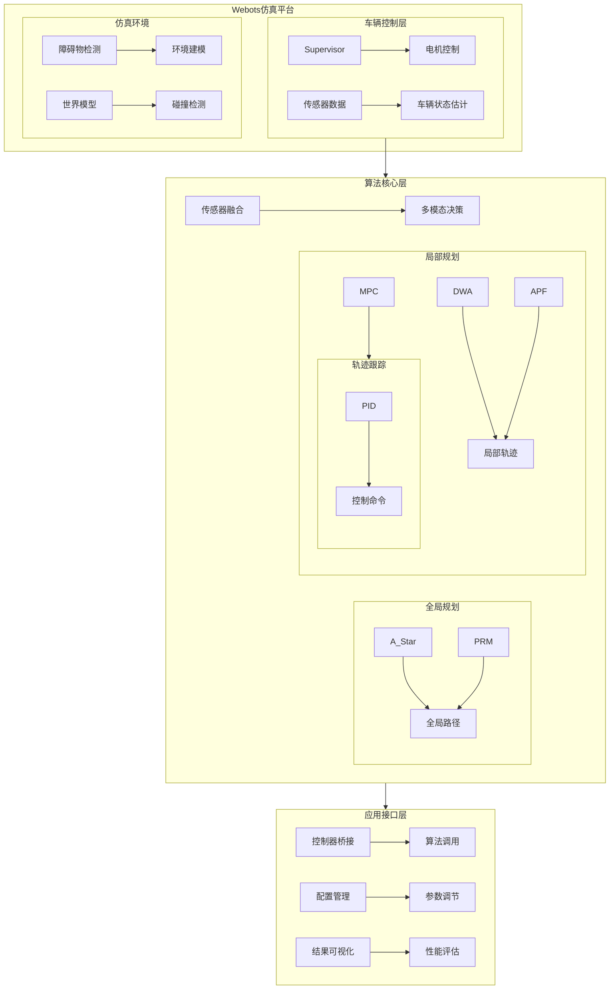
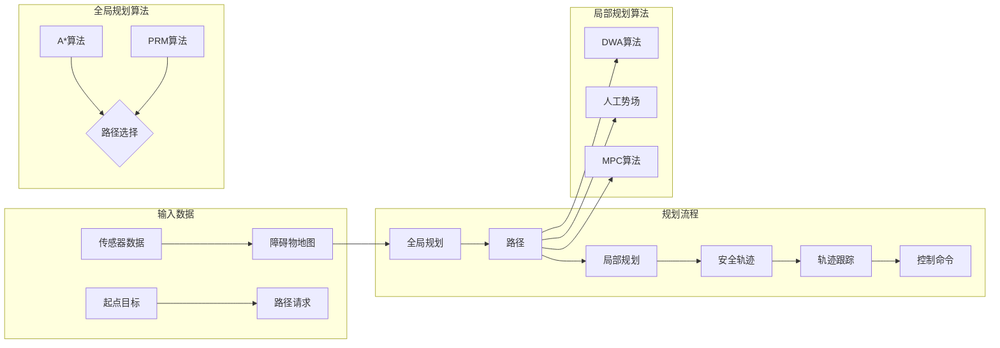
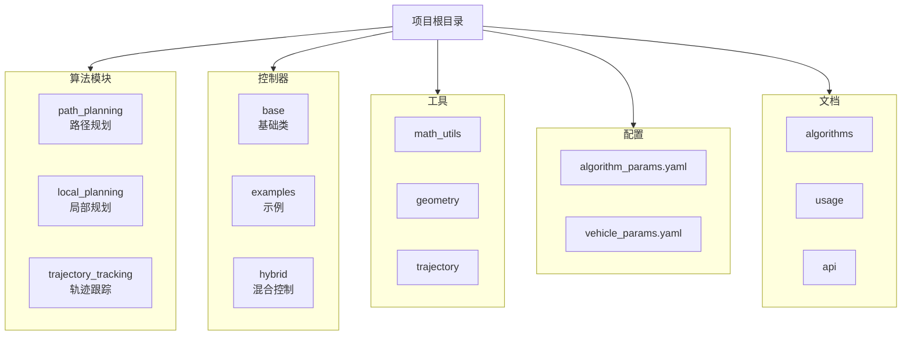
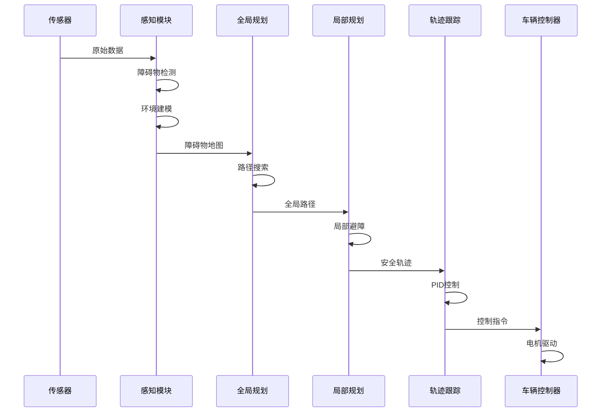
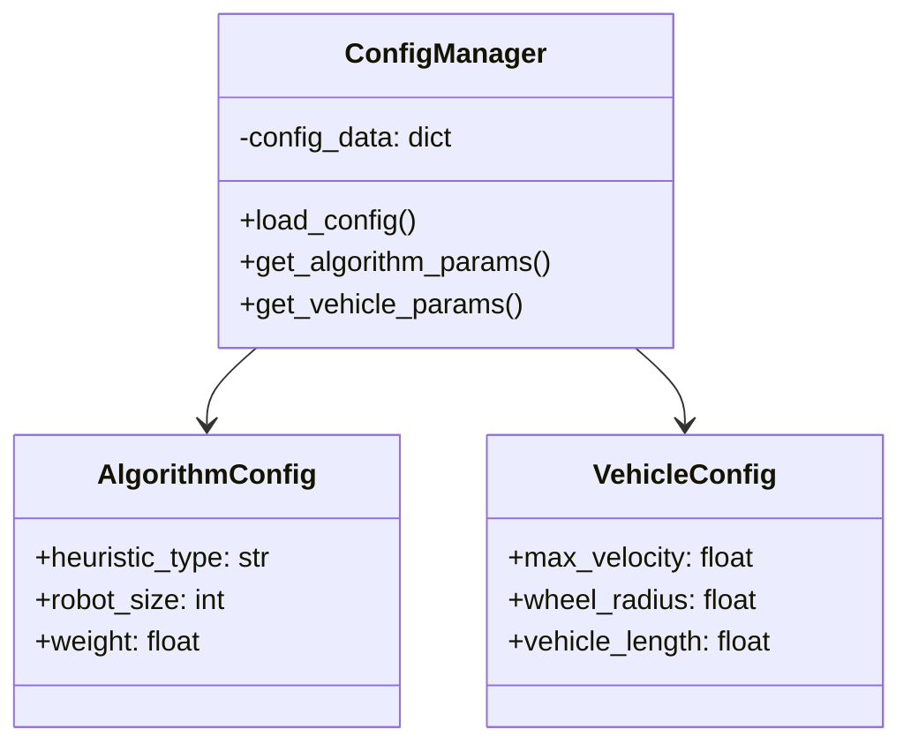

# 🏗️ 系统架构设计

## 系统整体架构

```mermaid
graph TB
    subgraph Webots仿真平台
        subgraph 车辆控制层
            Supervisor --> 电机控制
            传感器数据 --> 车辆状态估计
        end
        
        subgraph 仿真环境
            障碍物检测 --> 环境建模
            世界模型 --> 碰撞检测
        end
    end
    
    subgraph 算法核心层
        subgraph 全局规划
            A_Star --> 全局路径
            PRM --> 全局路径
        end
        
        subgraph 局部规划
            DWA --> 局部轨迹
            APF --> 局部轨迹
            MPC --> 轨迹跟踪
        end
        
        subgraph 轨迹跟踪
            PID --> 控制命令
        end
        
        传感器融合 --> 多模态决策
    end
    
    subgraph 应用接口层
        控制器桥接 --> 算法调用
        配置管理 --> 参数调节
        结果可视化 --> 性能评估
    end
    
    车辆控制层 --> 算法核心层
    算法核心层 --> 应用接口层
```

## 算法模块关系

```mermaid
graph LR
    subgraph 输入数据
        传感器数据 --> 障碍物地图
        起点目标 --> 路径请求
    end
    
    subgraph 规划流程
        障碍物地图 --> 全局规划
        全局规划 --> 路径
        路径 --> 局部规划
        局部规划 --> 安全轨迹
        安全轨迹 --> 轨迹跟踪
        轨迹跟踪 --> 控制命令
    end
    
    subgraph 全局规划算法
        A_Star[A*算法]
        PRM[PRM算法]
        选择器{路径选择}
        A_Star --> 选择器
        PRM --> 选择器
    end
    
    subgraph 局部规划算法
        DWA[DWA算法]
        APF[人工势场]
        MPC[MPC算法]
    end
    
    路径 --> DWA
    路径 --> APF
    路径 --> MPC
```

## 代码目录结构

```mermaid
graph TD
    root[项目根目录]
    
    subgraph algorithms[算法模块]
        pp[path_planning<br/>路径规划]
        lp[local_planning<br/>局部规划]
        tt[trajectory_tracking<br/>轨迹跟踪]
    end
    
    subgraph controllers[控制器]
        base[base<br/>基础类]
        examples[examples<br/>示例]
        hybrid[hybrid<br/>混合控制]
    end
    
    subgraph utils[工具]
        math[math_utils]
        geo[geometry]
        traj[trajectory]
    end
    
    subgraph config[配置]
        algo[algorithm_params.yaml]
        vehicle[vehicle_params.yaml]
    end
    
    subgraph docs[文档]
        alg_docs[algorithms]
        usage[usage]
        api[api]
    end
    
    root --> algorithms
    root --> controllers
    root --> utils
    root --> config
    root --> docs
```

## 数据流图

```mermaid
sequenceDiagram
    participant S as 传感器
    participant P as 感知模块
    participant G as 全局规划
    participant L as 局部规划
    participant T as 轨迹跟踪
    participant C as 车辆控制器
    
    S->>P: 原始数据
    P->>P: 障碍物检测
    P->>P: 环境建模
    P->>G: 障碍物地图
    G->>G: 路径搜索
    G->>L: 全局路径
    L->>L: 局部避障
    L->>T: 安全轨迹
    T->>T: PID控制
    T->>C: 控制指令
    C->>C: 电机驱动
```

## 配置管理架构

```mermaid
classDiagram
    class ConfigManager {
        +load_config()
        +get_algorithm_params()
        +get_vehicle_params()
        -config_data: dict
    }
    
    class AlgorithmConfig {
        +heuristic_type: str
        +robot_size: int
        +weight: float
    }
    
    class VehicleConfig {
        +max_velocity: float
        +wheel_radius: float
        +vehicle_length: float
    }
    
    ConfigManager --> AlgorithmConfig
    ConfigManager --> VehicleConfig
```